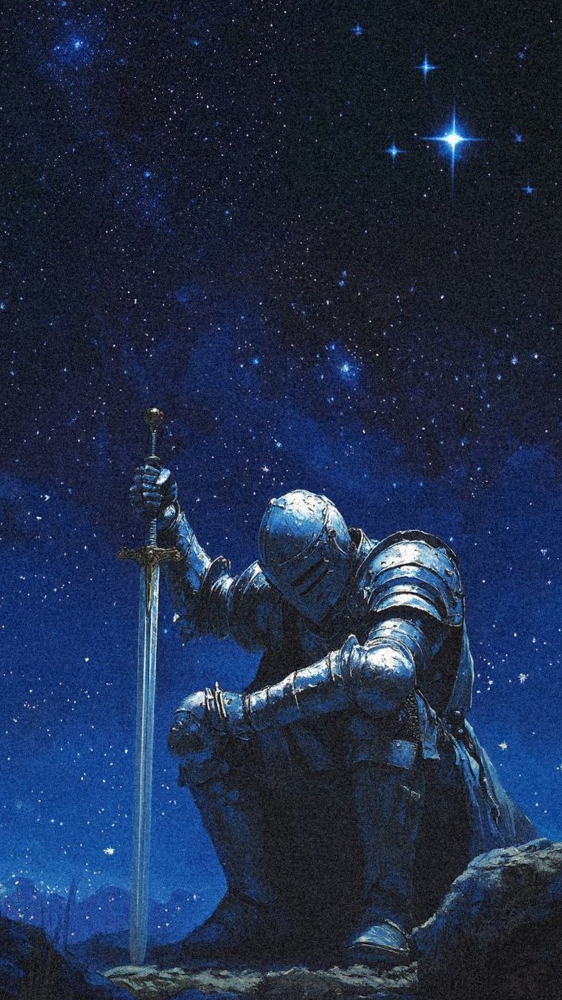

### five550fifty

I write Python and build small web and desktop apps.
Most of what you see here is me learning by making things.

Currently working with **Python, Flask and SQLite**, plus HTML, CSS and JavaScript for the web.

#### A few things I've built

[**Budget tracker**](https://github.com/five550fifty/budget_tracker)  
A desktop app for tracking spending and saving goals, with charts to see where the money goes.

[**Portfolio website**](https://github.com/five550fifty/portfolio_website)  
My Flask site, with light and dark themes and a contact form backed by SQLite.

[**High score manager**](https://github.com/five550fifty/high-score-manager)  
A Python CLI for keeping scores, finding players and updating a leaderboard.

 

#### Languages & tools

  

Python · HTML · CSS · JavaScript &nbsp; / &nbsp; Flask · SQLite

---

[repos](https://github.com/five550fifty?tab=repositories) · [email](mailto:Bardyuka@inbox.ru)

