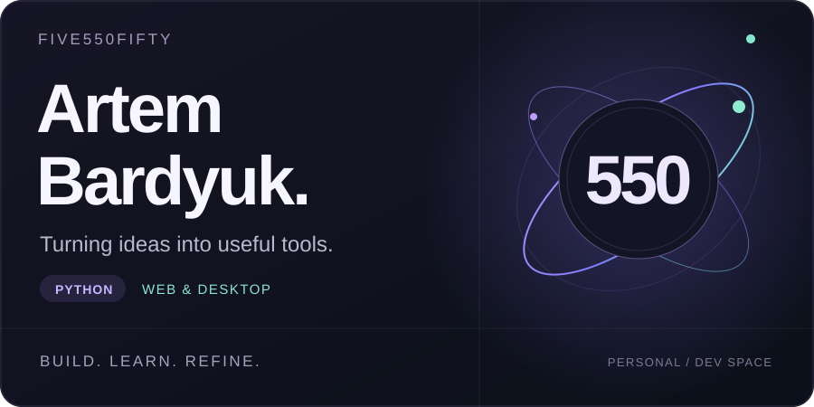

  

### Hi, I'm Artem.

I build Python applications and web projects, from desktop budget tools to Flask websites. This is where I share what I'm building and learning along the way.

**Python apps · Web development · Learning by building**

### My toolkit

`Python` `Flask` `SQLite` `Tkinter` `Matplotlib` `HTML` `CSS` `JavaScript`

### Selected projects

| Project | What it does | Built with |
| :--- | :--- | :--- |
| **[Portfolio Website](https://github.com/five550fifty/portfolio_website)** | A responsive personal website with a theme toggle and a contact form. | Flask, SQLite, HTML, CSS, JavaScript |
| **[Budget Tracker](https://github.com/five550fifty/budget_tracker)** | A desktop app for income, expenses, savings goals and spending charts. | Python, Tkinter, Matplotlib |
| **[High Score Manager](https://github.com/five550fifty/high-score-manager)** | A command-line leaderboard with player search and saved scores. | Python, file storage |

### Around here

You'll find small, practical projects exploring user interfaces, data storage and everyday tools. Each one is a chance to turn an idea into something that works.

---

**Let's connect** — [Email](mailto:Bardyuka@inbox.ru) · [Explore my repositories](https://github.com/five550fifty?tab=repositories)
