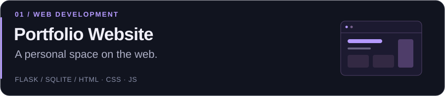
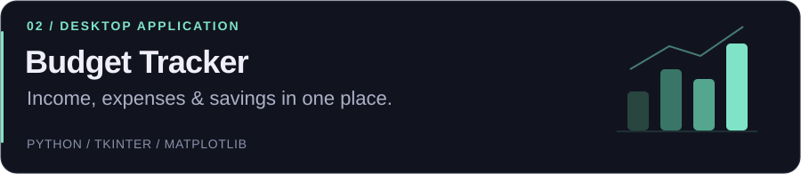
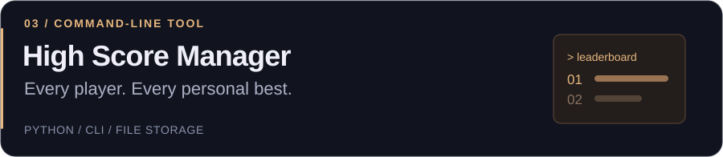
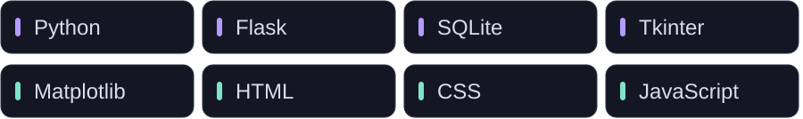

  

  I build <b>Python applications</b> and <b>web projects</b>. 
  Learning through practical tools, thoughtful interfaces and small experiments.

  <a href="https://github.com/five550fifty?tab=repositories">Explore my code</a> &nbsp; · &nbsp;
  <a href="mailto:Bardyuka@inbox.ru">Get in touch</a>

 

### Selected work

 

### Tools I work with

 

Small ideas. Useful tools. Steady progress.

